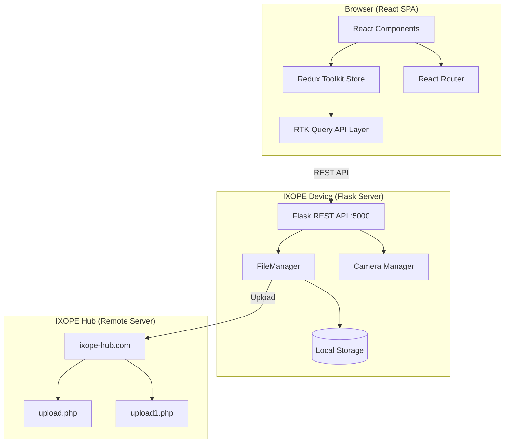
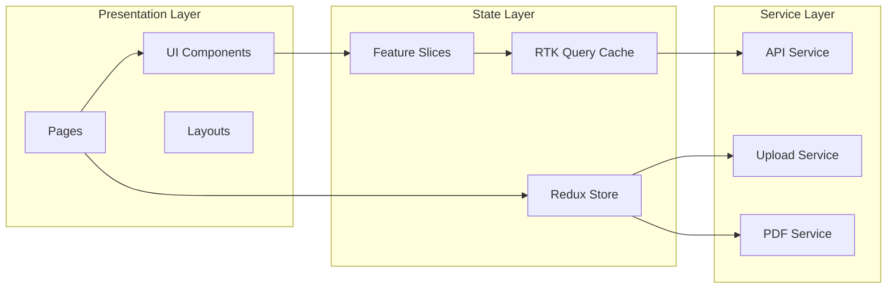
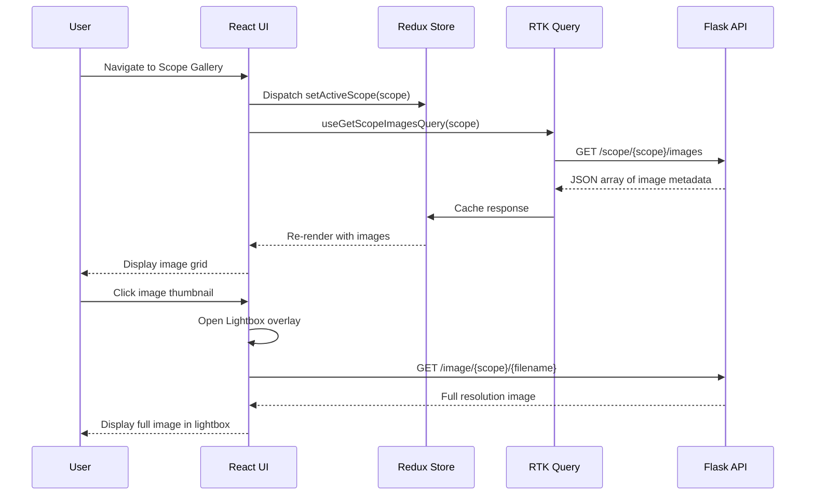
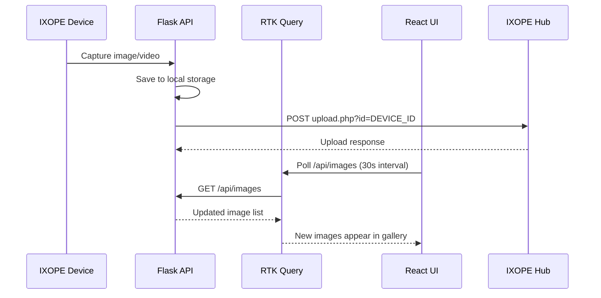
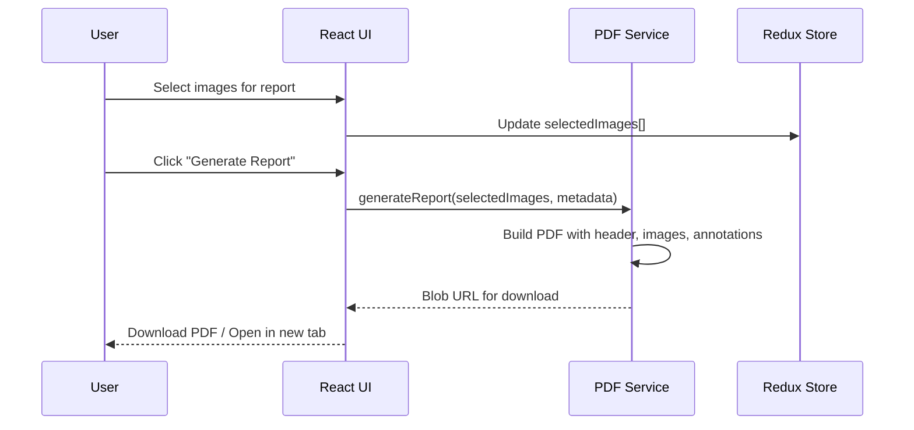

# Design Document: IXOPE Web Portal

## Overview

The IXOPE Web Portal is a modern medical imaging management application that replaces the legacy PHP/jQuery web interface. Built with Vite + React (TypeScript), Tailwind CSS, and Redux Toolkit (RTK Query), it provides a clinical-grade UI for managing images and videos captured by the IXOPE medical imaging device across four scope categories: Ophthalmoscope (opth), Otoscope (oto), Dermatoscope (derm), and Microscope (micro).

The portal connects to the IXOPE device's Flask REST API for real-time data access, supports category-wise file browsing with lightbox viewing, upload management to the IXOPE Hub server, device health monitoring, live camera feed viewing, and PDF report generation. The design prioritizes a clean, accessible medical UI with dark/light theme support suitable for clinical environments.

The application architecture follows a single-page application (SPA) pattern with client-side routing, centralized state management via Redux Toolkit, and API communication through RTK Query's auto-generated hooks for caching, polling, and optimistic updates.

## Architecture



### Application Layer Architecture



## Sequence Diagrams

### Image Gallery Loading Flow



### Upload Tracking Flow



### PDF Report Generation Flow



## Components and Interfaces

### Component 1: RTK Query API Service

**Purpose**: Centralized API layer with caching, auto-refetching, and type-safe hooks for all Flask server communication.

**Interface**:
```typescript
// src/services/api.ts
import { createApi, fetchBaseQuery } from '@reduxjs/toolkit/query/react';

interface ImageMeta {
  filename: string;
  path: string;
  dir: string;
  scope: ScopeCategory;
  size: number;
  created: string; // ISO 8601
}

interface VideoMeta {
  filename: string;
  path: string;
  dir: string;
  scope: ScopeCategory;
  size: number;
  created: string;
}

interface ScopeStats {
  scope: ScopeCategory;
  images: number;
  videos: number;
}

interface HealthStatus {
  status: 'ok' | 'error';
  camera: 'available' | 'unavailable';
  timestamp: string;
}

type ScopeCategory = 'opth' | 'oto' | 'derm' | 'micro';

const ixopeApi = createApi({
  reducerPath: 'ixopeApi',
  baseQuery: fetchBaseQuery({ baseUrl: '/api' }),
  tagTypes: ['Images', 'Videos', 'Health'],
  endpoints: (builder) => ({
    getAllImages: builder.query<ImageMeta[], void>(),
    getAllVideos: builder.query<VideoMeta[], void>(),
    getScopeImages: builder.query<{ images: ImageMeta[] }, ScopeCategory>(),
    getScopeVideos: builder.query<{ videos: VideoMeta[] }, ScopeCategory>(),
    getScopeStats: builder.query<ScopeStats, ScopeCategory>(),
    getHealth: builder.query<HealthStatus, void>(),
    deleteVideo: builder.mutation<{ message: string }, string>(),
  }),
});
```

**Responsibilities**:
- Manage all HTTP communication with the Flask server
- Provide cache invalidation on mutations (delete, upload)
- Auto-poll health endpoint for device connectivity status
- Generate typed React hooks for each endpoint

### Component 2: Redux Store & Feature Slices

**Purpose**: Centralized client-side state for UI preferences, active selections, and upload tracking.

**Interface**:
```typescript
// src/store/slices/uiSlice.ts
interface UIState {
  theme: 'dark' | 'light';
  sidebarOpen: boolean;
  activeScope: ScopeCategory | null;
  lightbox: {
    open: boolean;
    currentIndex: number;
    items: ImageMeta[];
  };
}

// src/store/slices/deviceSlice.ts
interface DeviceState {
  deviceId: string;
  serverUrl: string;
  connected: boolean;
  lastHealthCheck: string | null;
}

// src/store/slices/uploadSlice.ts
interface UploadState {
  queue: UploadItem[];
  activeUploads: number;
  history: UploadRecord[];
}

interface UploadItem {
  id: string;
  file: File;
  scope: ScopeCategory;
  status: 'pending' | 'uploading' | 'success' | 'error';
  progress: number;
  error?: string;
}

// src/store/slices/reportSlice.ts
interface ReportState {
  selectedImages: ImageMeta[];
  patientInfo: PatientInfo | null;
  generating: boolean;
}
```

**Responsibilities**:
- Persist theme preference in localStorage
- Track device connectivity state
- Manage upload queue with progress tracking
- Hold image selections for PDF report generation

### Component 3: Page Components

**Purpose**: Top-level route components that compose the UI.

**Interface**:
```typescript
// src/pages/Dashboard.tsx
// Overview: scope category cards with stats, device health, recent captures
interface DashboardProps {}

// src/pages/ScopeGallery.tsx
// Category-specific image/video gallery with grid/list view toggle
interface ScopeGalleryProps {
  scope: ScopeCategory;
}

// src/pages/LiveFeed.tsx
// MJPEG live stream viewer from the device camera
interface LiveFeedProps {}

// src/pages/DeviceManagement.tsx
// Device info, health status, connection settings
interface DeviceManagementProps {}

// src/pages/Reports.tsx
// Image selection and PDF report generation
interface ReportsProps {}

// src/pages/Uploads.tsx
// Upload queue, history, and manual upload trigger
interface UploadsProps {}
```

**Responsibilities**:
- Compose feature-specific UI from shared components
- Connect to Redux store for page-level state
- Handle route parameters (scope category from URL)

### Component 4: Shared UI Components

**Purpose**: Reusable clinical-grade UI primitives.

**Interface**:
```typescript
// src/components/ui/ScopeCard.tsx
interface ScopeCardProps {
  scope: ScopeCategory;
  stats: ScopeStats;
  onClick: () => void;
}

// src/components/ui/ImageGrid.tsx
interface ImageGridProps {
  images: ImageMeta[];
  onImageClick: (index: number) => void;
  selectable?: boolean;
  selectedIds?: string[];
  onSelectionChange?: (ids: string[]) => void;
}

// src/components/ui/Lightbox.tsx
interface LightboxProps {
  items: (ImageMeta | VideoMeta)[];
  currentIndex: number;
  onClose: () => void;
  onNavigate: (index: number) => void;
}

// src/components/ui/VideoPlayer.tsx
interface VideoPlayerProps {
  src: string;
  poster?: string;
  onDelete?: () => void;
}

// src/components/ui/DeviceStatusBadge.tsx
interface DeviceStatusBadgeProps {
  connected: boolean;
  lastCheck: string | null;
}

// src/components/ui/UploadProgress.tsx
interface UploadProgressProps {
  item: UploadItem;
  onCancel?: () => void;
  onRetry?: () => void;
}
```

## Data Models

### Model 1: ScopeCategory

```typescript
type ScopeCategory = 'opth' | 'oto' | 'derm' | 'micro';

const SCOPE_LABELS: Record<ScopeCategory, string> = {
  opth: 'Ophthalmoscope',
  oto: 'Otoscope',
  derm: 'Dermatoscope',
  micro: 'Microscope',
};

const SCOPE_ICONS: Record<ScopeCategory, string> = {
  opth: 'Eye',
  oto: 'Ear',
  derm: 'Scan',
  micro: 'Microscope',
};

const SCOPE_COLORS: Record<ScopeCategory, { bg: string; accent: string }> = {
  opth: { bg: 'bg-blue-50 dark:bg-blue-950', accent: 'text-blue-600 dark:text-blue-400' },
  oto: { bg: 'bg-emerald-50 dark:bg-emerald-950', accent: 'text-emerald-600 dark:text-emerald-400' },
  derm: { bg: 'bg-amber-50 dark:bg-amber-950', accent: 'text-amber-600 dark:text-amber-400' },
  micro: { bg: 'bg-purple-50 dark:bg-purple-950', accent: 'text-purple-600 dark:text-purple-400' },
};
```

**Validation Rules**:
- ScopeCategory must be one of the four predefined values
- All scope-related lookups must handle unknown scopes gracefully

### Model 2: ImageMeta & VideoMeta

```typescript
interface ImageMeta {
  filename: string;    // e.g. "OPTH_20250617_143022.jpg"
  path: string;        // e.g. "/image/opth/OPTH_20250617_143022.jpg"
  dir: string;         // Server-side directory path
  scope: ScopeCategory;
  size: number;        // bytes
  created: string;     // ISO 8601 timestamp
}

interface VideoMeta {
  filename: string;    // e.g. "DERM_20250617_150100.mp4"
  path: string;        // e.g. "/video/DERM_20250617_150100.mp4"
  dir: string;
  scope: ScopeCategory;
  size: number;
  created: string;
}
```

**Validation Rules**:
- `filename` must be non-empty string
- `path` must start with `/image/` or `/video/`
- `size` must be a positive integer
- `created` must be valid ISO 8601 date string
- `scope` must be a valid ScopeCategory

### Model 3: Device Configuration

```typescript
interface DeviceConfig {
  deviceId: string;         // e.g. "1001"
  serverUrl: string;        // e.g. "https://ixope-hub.com"
  flaskBaseUrl: string;     // e.g. "http://192.168.1.100:5000"
  pollingInterval: number;  // ms, default 30000
}

interface PatientInfo {
  name: string;
  id: string;
  dateOfBirth?: string;
  notes?: string;
}
```

**Validation Rules**:
- `deviceId` must be numeric string
- `serverUrl` must be valid HTTPS URL
- `flaskBaseUrl` must be valid HTTP/HTTPS URL
- `pollingInterval` must be >= 5000ms

## Algorithmic Pseudocode

### Image Gallery Loading Algorithm

```typescript
/**
 * ALGORITHM: loadScopeGallery
 * INPUT: scope: ScopeCategory
 * OUTPUT: Rendered image grid with thumbnails
 *
 * PRECONDITIONS:
 * - scope is a valid ScopeCategory
 * - Flask server is reachable
 *
 * POSTCONDITIONS:
 * - Images are cached in RTK Query store
 * - Grid displays thumbnails sorted by creation date (newest first)
 * - Empty state shown if no images exist for scope
 */
function loadScopeGallery(scope: ScopeCategory): void {
  // Step 1: Trigger RTK Query fetch with cache check
  const { data, isLoading, error } = useGetScopeImagesQuery(scope);

  // Step 2: Handle loading state
  if (isLoading) {
    renderSkeletonGrid();
    return;
  }

  // Step 3: Handle error state
  if (error) {
    renderErrorState(error);
    return;
  }

  // Step 4: Handle empty state
  if (!data?.images?.length) {
    renderEmptyState(scope);
    return;
  }

  // Step 5: Sort and render
  const sorted = [...data.images].sort(
    (a, b) => new Date(b.created).getTime() - new Date(a.created).getTime()
  );

  renderImageGrid(sorted);
}
```

### Upload Queue Processing Algorithm

```typescript
/**
 * ALGORITHM: processUploadQueue
 * INPUT: queue: UploadItem[]
 * OUTPUT: Updated queue with completed/failed uploads
 *
 * PRECONDITIONS:
 * - queue contains items with status 'pending'
 * - Network connectivity to IXOPE Hub
 * - DEVICE_ID is configured
 *
 * POSTCONDITIONS:
 * - All pending items are processed (success or error)
 * - Upload progress is tracked for each item
 * - Failed uploads remain in queue for retry
 *
 * LOOP INVARIANT:
 * - activeUploads <= MAX_CONCURRENT_UPLOADS (3)
 * - All completed items have status 'success' or 'error'
 */
const MAX_CONCURRENT_UPLOADS = 3;

async function processUploadQueue(queue: UploadItem[]): Promise<void> {
  const pending = queue.filter(item => item.status === 'pending');
  const batches = chunk(pending, MAX_CONCURRENT_UPLOADS);

  for (const batch of batches) {
    // INVARIANT: batch.length <= MAX_CONCURRENT_UPLOADS
    await Promise.allSettled(
      batch.map(item => uploadSingleFile(item))
    );
  }
}

async function uploadSingleFile(item: UploadItem): Promise<void> {
  dispatch(updateUploadStatus({ id: item.id, status: 'uploading', progress: 0 }));

  const endpoint = item.file.type.startsWith('video/')
    ? `${SERVER_URL}/upload1.php?id=${DEVICE_ID}`
    : `${SERVER_URL}/upload.php?id=${DEVICE_ID}`;

  const formData = new FormData();
  formData.append('file', item.file);

  try {
    const response = await fetch(endpoint, {
      method: 'POST',
      body: formData,
    });

    if (response.ok) {
      dispatch(updateUploadStatus({ id: item.id, status: 'success', progress: 100 }));
    } else {
      dispatch(updateUploadStatus({ id: item.id, status: 'error', error: `HTTP ${response.status}` }));
    }
  } catch (error) {
    dispatch(updateUploadStatus({ id: item.id, status: 'error', error: error.message }));
  }
}
```

### PDF Report Generation Algorithm

```typescript
/**
 * ALGORITHM: generateMedicalReport
 * INPUT: selectedImages: ImageMeta[], patient: PatientInfo, deviceId: string
 * OUTPUT: PDF Blob for download
 *
 * PRECONDITIONS:
 * - selectedImages.length >= 1
 * - patient.name is non-empty
 * - Images are accessible via their path URLs
 *
 * POSTCONDITIONS:
 * - Generated PDF contains header with device/patient info
 * - All selected images are embedded in the PDF
 * - Images are laid out in a grid format (2 per row)
 * - PDF file size is reasonable (compressed images)
 *
 * LOOP INVARIANT:
 * - Each processed image is added to exactly one page position
 * - Page breaks occur after every 4 images (2x2 grid per page)
 */
async function generateMedicalReport(
  selectedImages: ImageMeta[],
  patient: PatientInfo,
  deviceId: string
): Promise<Blob> {
  const doc = new jsPDF('p', 'mm', 'a4');
  const IMAGES_PER_PAGE = 4;
  const MARGIN = 15;
  const IMG_WIDTH = 80;
  const IMG_HEIGHT = 60;

  // Step 1: Add report header
  addReportHeader(doc, patient, deviceId);

  // Step 2: Process images in pages
  for (let i = 0; i < selectedImages.length; i++) {
    // INVARIANT: page break at every IMAGES_PER_PAGE boundary
    if (i > 0 && i % IMAGES_PER_PAGE === 0) {
      doc.addPage();
      addPageHeader(doc, i / IMAGES_PER_PAGE + 1);
    }

    const img = selectedImages[i];
    const position = i % IMAGES_PER_PAGE;
    const row = Math.floor(position / 2);
    const col = position % 2;

    const x = MARGIN + col * (IMG_WIDTH + 10);
    const y = 60 + row * (IMG_HEIGHT + 20);

    // Fetch and embed image
    const imageData = await fetchImageAsBase64(img.path);
    doc.addImage(imageData, 'JPEG', x, y, IMG_WIDTH, IMG_HEIGHT);

    // Add caption
    doc.setFontSize(8);
    doc.text(`${img.scope.toUpperCase()} - ${formatDate(img.created)}`, x, y + IMG_HEIGHT + 5);
  }

  // Step 3: Add footer
  addReportFooter(doc, selectedImages.length);

  return doc.output('blob');
}
```

### Theme Management Algorithm

```typescript
/**
 * ALGORITHM: initializeTheme
 * INPUT: none (reads from localStorage and system preference)
 * OUTPUT: Applied theme class on document root
 *
 * PRECONDITIONS:
 * - DOM is ready
 * - Tailwind dark mode configured as 'class' strategy
 *
 * POSTCONDITIONS:
 * - document.documentElement has correct 'dark' class
 * - localStorage contains persisted preference
 * - System preference listener is registered
 */
function initializeTheme(): 'dark' | 'light' {
  // Priority: localStorage > system preference > default (dark)
  const stored = localStorage.getItem('ixope-theme');

  if (stored === 'dark' || stored === 'light') {
    applyTheme(stored);
    return stored;
  }

  // Check system preference
  const prefersDark = window.matchMedia('(prefers-color-scheme: dark)').matches;
  const theme = prefersDark ? 'dark' : 'light';
  applyTheme(theme);
  localStorage.setItem('ixope-theme', theme);
  return theme;
}

function applyTheme(theme: 'dark' | 'light'): void {
  if (theme === 'dark') {
    document.documentElement.classList.add('dark');
  } else {
    document.documentElement.classList.remove('dark');
  }
}
```

## Key Functions with Formal Specifications

### Function 1: useDeviceConnection()

```typescript
function useDeviceConnection(baseUrl: string, pollingInterval: number): DeviceConnectionState
```

**Preconditions:**
- `baseUrl` is a valid HTTP URL pointing to the Flask server
- `pollingInterval` >= 5000 (minimum 5 seconds)

**Postconditions:**
- Returns current connection state (connected/disconnected)
- Health endpoint is polled at the specified interval
- Connection status updates within one polling cycle of actual state change
- Cleanup function cancels polling on unmount

**Loop Invariants:**
- Polling interval remains constant throughout component lifecycle
- Only one active poll request at a time (no overlapping requests)

### Function 2: useLightbox()

```typescript
function useLightbox(items: MediaItem[]): {
  open: (index: number) => void;
  close: () => void;
  next: () => void;
  prev: () => void;
  current: MediaItem | null;
  currentIndex: number;
  isOpen: boolean;
}
```

**Preconditions:**
- `items` is a non-empty array of ImageMeta or VideoMeta objects
- Each item has a valid `path` for loading

**Postconditions:**
- `open(index)` sets isOpen=true and currentIndex=index (clamped to valid range)
- `close()` sets isOpen=false
- `next()` increments currentIndex (wraps to 0 at end)
- `prev()` decrements currentIndex (wraps to length-1 at start)
- Keyboard navigation: ArrowRight=next, ArrowLeft=prev, Escape=close

**Loop Invariants:**
- `currentIndex` is always within [0, items.length - 1] when isOpen=true

### Function 3: formatFileSize()

```typescript
function formatFileSize(bytes: number): string
```

**Preconditions:**
- `bytes` >= 0

**Postconditions:**
- Returns human-readable string: "X.X KB", "X.X MB", or "X.X GB"
- bytes < 1024 → "X B"
- bytes < 1048576 → "X.X KB"
- bytes < 1073741824 → "X.X MB"
- else → "X.X GB"
- Result always has at most 1 decimal place

### Function 4: groupMediaByDate()

```typescript
function groupMediaByDate(items: MediaItem[]): Map<string, MediaItem[]>
```

**Preconditions:**
- Each item has a valid `created` ISO 8601 timestamp
- `items` array may be empty

**Postconditions:**
- Returns Map with date strings as keys (YYYY-MM-DD format)
- Each group contains items from that calendar date
- Groups are ordered by date descending (newest first)
- Items within each group maintain their relative order
- Sum of all group sizes equals items.length (no items lost)

## Example Usage

```typescript
// Example 1: Dashboard with scope cards
function Dashboard() {
  const scopes: ScopeCategory[] = ['opth', 'oto', 'derm', 'micro'];

  return (
    <div className="grid grid-cols-1 md:grid-cols-2 lg:grid-cols-4 gap-6 p-6">
      {scopes.map(scope => (
        <ScopeCard key={scope} scope={scope} />
      ))}
      <DeviceHealthCard />
      <RecentCapturesCard />
    </div>
  );
}

// Example 2: Scope gallery with lightbox
function ScopeGallery({ scope }: { scope: ScopeCategory }) {
  const { data, isLoading } = useGetScopeImagesQuery(scope);
  const lightbox = useLightbox(data?.images ?? []);

  if (isLoading) return <SkeletonGrid count={12} />;

  return (
    <>
      <ImageGrid
        images={data?.images ?? []}
        onImageClick={lightbox.open}
      />
      {lightbox.isOpen && (
        <Lightbox
          items={data?.images ?? []}
          currentIndex={lightbox.currentIndex}
          onClose={lightbox.close}
          onNavigate={lightbox.open}
        />
      )}
    </>
  );
}

// Example 3: RTK Query API definition
const ixopeApi = createApi({
  reducerPath: 'ixopeApi',
  baseQuery: fetchBaseQuery({ baseUrl: deviceConfig.flaskBaseUrl }),
  tagTypes: ['Images', 'Videos', 'Health'],
  endpoints: (builder) => ({
    getAllImages: builder.query<ImageMeta[], void>({
      query: () => '/api/images',
      providesTags: ['Images'],
    }),
    getScopeImages: builder.query<{ images: ImageMeta[] }, ScopeCategory>({
      query: (scope) => `/scope/${scope}/images`,
      providesTags: (result, error, scope) => [{ type: 'Images', id: scope }],
    }),
    getScopeStats: builder.query<ScopeStats, ScopeCategory>({
      query: (scope) => `/scope/${scope}/stats`,
    }),
    getHealth: builder.query<HealthStatus, void>({
      query: () => '/health',
      providesTags: ['Health'],
    }),
    deleteVideo: builder.mutation<{ message: string }, string>({
      query: (filename) => ({
        url: `/video/${filename}`,
        method: 'DELETE',
      }),
      invalidatesTags: ['Videos'],
    }),
  }),
});

// Example 4: Upload management
function UploadManager() {
  const dispatch = useAppDispatch();
  const { queue } = useAppSelector(state => state.upload);

  const handleFileSelect = (files: FileList, scope: ScopeCategory) => {
    Array.from(files).forEach(file => {
      dispatch(addToUploadQueue({
        id: crypto.randomUUID(),
        file,
        scope,
        status: 'pending',
        progress: 0,
      }));
    });
  };

  return (
    <div>
      <UploadDropzone onFilesSelected={handleFileSelect} />
      <UploadQueueList items={queue} />
    </div>
  );
}
```

## Correctness Properties

### Property 1: Scope Category Completeness
∀ scope ∈ ScopeCategory: SCOPE_LABELS[scope] !== undefined — All scope categories have labels, icons, and colors defined.

**Validates: Requirements 1.1, 7.7**

### Property 2: Image Path Integrity
∀ img ∈ ImageMeta: img.path === `/image/${img.scope}/${img.filename}` — Image paths always follow the Flask API URL pattern.

**Validates: Requirements 2.1, 9.1**

### Property 3: Gallery Sorting Invariant
∀ i ∈ [0, images.length-2]: new Date(images[i].created) >= new Date(images[i+1].created) — Gallery always displays newest images first.

**Validates: Requirements 2.1, 1.5**

### Property 4: Upload Queue Consistency
∀ item ∈ uploadQueue: item.status ∈ {'pending', 'uploading', 'success', 'error'} ∧ (item.status === 'uploading' → 0 <= item.progress <= 100) ∧ (item.status === 'success' → item.progress === 100) ∧ (item.status === 'error' → item.error !== undefined).

**Validates: Requirements 4.1, 4.3, 4.4, 4.5**

### Property 5: Lightbox Navigation Bounds
∀ state where lightbox.isOpen: 0 <= lightbox.currentIndex < lightbox.items.length.

**Validates: Requirements 2.3, 2.4**

### Property 6: Theme Persistence
After initializeTheme(): localStorage.getItem('ixope-theme') ∈ {'dark', 'light'} ∧ document.documentElement.classList.contains('dark') ↔ theme === 'dark'.

**Validates: Requirements 7.1, 7.2, 7.3, 7.4**

### Property 7: File Size Formatting
∀ n >= 0: formatFileSize(n).length > 0 ∧ formatFileSize(n) matches /^\d+(\.\d)?\s(B|KB|MB|GB)$/.

**Validates: Requirements 3.1, 4.1**

### Property 8: Media Grouping Completeness
∀ items: sum(groupMediaByDate(items).values().map(g => g.length)) === items.length — No items are lost during grouping.

**Validates: Requirements 2.1, 3.1**

### Property 9: RTK Query Cache Invalidation
After deleteVideo(filename) succeeds: 'Videos' tag is invalidated → next query refetches fresh data.

**Validates: Requirements 3.5, 9.3**

### Property 10: Device Health Polling
useDeviceConnection interval: time between consecutive /health requests ≈ pollingInterval ± network latency.

**Validates: Requirements 5.2, 9.5**

## Error Handling

### Error Scenario 1: Device Unreachable

**Condition**: Flask server at `flaskBaseUrl` is not responding (network timeout or connection refused)
**Response**: Display prominent "Device Offline" banner in the header. Disable live feed. Show cached data if available with "Last synced: X minutes ago" indicator.
**Recovery**: Continue polling health endpoint. Auto-reconnect when device responds. Show "Device Online" toast notification on recovery.

### Error Scenario 2: Image/Video Load Failure

**Condition**: Individual media file returns 404 or fails to load
**Response**: Display broken-image placeholder with scope icon. Show "File not found" tooltip on hover. Log error for debugging.
**Recovery**: User can trigger manual refresh. RTK Query retry logic (3 attempts with exponential backoff).

### Error Scenario 3: Upload Failure

**Condition**: POST to upload.php/upload1.php fails (network error, server error, timeout)
**Response**: Mark upload item as 'error' with descriptive message. Keep item in queue for retry. Show error badge on upload nav item.
**Recovery**: Manual retry button per item. "Retry All Failed" bulk action. Automatic retry on next queue processing cycle.

### Error Scenario 4: PDF Generation Failure

**Condition**: Image fetch fails during PDF generation (image URL inaccessible)
**Response**: Skip failed image, add placeholder text "Image unavailable" in PDF. Show warning toast listing skipped images.
**Recovery**: User can retry with different selection. Failed images highlighted in selection UI.

### Error Scenario 5: Invalid API Response

**Condition**: Flask API returns malformed JSON or unexpected schema
**Response**: RTK Query error state triggers. Show generic "Data format error" message. Log full response for debugging.
**Recovery**: Manual refresh button. Auto-retry on next poll cycle.

## Testing Strategy

### Unit Testing Approach

- **Framework**: Vitest + React Testing Library
- **Coverage targets**: 80%+ for utility functions, 70%+ for components
- **Key test cases**:
  - `formatFileSize()` with edge cases (0, boundary values, very large)
  - `groupMediaByDate()` with empty arrays, single items, items across dates
  - Theme initialization with various localStorage/system states
  - Lightbox navigation wrapping logic
  - Upload queue state transitions

### Property-Based Testing Approach

- **Library**: fast-check
- **Properties to test**:
  - `formatFileSize` always returns a valid formatted string for any non-negative integer
  - `groupMediaByDate` preserves total item count (no data loss)
  - Gallery sort order is maintained after any filtering operation
  - Upload queue state machine transitions are valid (no impossible states)
  - Lightbox index is always within bounds after any sequence of next/prev

### Integration Testing Approach

- **Framework**: Vitest with MSW (Mock Service Worker) for API mocking
- **Key scenarios**:
  - Full dashboard load with all scope stats
  - Scope gallery load → lightbox open → navigate → close
  - Upload flow: select files → queue → progress → completion
  - Device offline → reconnect → data refresh
  - PDF generation with multiple images

## Performance Considerations

- **Image thumbnails**: Use CSS `object-fit: cover` with fixed dimensions; lazy load with `loading="lazy"` and Intersection Observer
- **RTK Query caching**: Cache images/videos with 30s stale time; background refetch on window focus
- **Virtual scrolling**: For galleries with 100+ items, use `react-window` or `@tanstack/react-virtual`
- **MJPEG live feed**: Render in `` tag with `src` pointing to `/live_feed` endpoint; no JS processing needed
- **Upload chunking**: Large video files (>50MB) should show progress via XHR `onprogress`
- **Bundle splitting**: Route-based code splitting with React.lazy() for each page component
- **Image optimization**: Generate thumbnails client-side using canvas for grid display; load full resolution only in lightbox

## Security Considerations

- **CORS**: Flask server must enable CORS for the web portal origin; configure `flask-cors` with specific allowed origins
- **Input validation**: Sanitize all user inputs (patient info, filenames) before PDF embedding or display
- **File upload validation**: Accept only image formats (jpg, png, bmp) and video formats (mp4, avi, mov, webm); validate MIME types client-side and reject on mismatch
- **XSS prevention**: React's default JSX escaping handles most cases; avoid `dangerouslySetInnerHTML`; sanitize any dynamic content from API
- **Device ID exposure**: Device ID is used in upload URLs; ensure it's not leaked in client-side logs or error messages shown to unauthorized users
- **No authentication on device API**: The Flask server has no auth (local network device); the portal should only be used on trusted networks. Display network security warning if accessed over non-local addresses.
- **Content Security Policy**: Configure CSP headers to restrict image/media sources to the Flask server and IXOPE Hub domains only

## Dependencies

| Package | Purpose | Version |
|---------|---------|---------|
| react | UI framework | ^18.2.0 |
| react-dom | DOM rendering | ^18.2.0 |
| react-router-dom | Client-side routing | ^6.x |
| @reduxjs/toolkit | State management + RTK Query | ^2.x |
| react-redux | React-Redux bindings | ^9.x |
| tailwindcss | Utility-first CSS | ^3.4.x |
| lucide-react | Medical-friendly icon set | ^0.x |
| jspdf | PDF generation | ^2.x |
| react-hot-toast | Toast notifications | ^2.x |
| vite | Build tool | ^5.x |
| typescript | Type safety | ^5.x |
| vitest | Test runner | ^1.x |
| @testing-library/react | Component testing | ^14.x |
| fast-check | Property-based testing | ^3.x |
| msw | API mocking for tests | ^2.x |

### Dev Dependencies

| Package | Purpose |
|---------|---------|
| @types/react | React type definitions |
| @types/react-dom | ReactDOM type definitions |
| @vitejs/plugin-react | Vite React plugin |
| autoprefixer | PostCSS autoprefixer |
| postcss | CSS processing |
| eslint | Code linting |
| prettier | Code formatting |

## Project Structure

```
ixope_web/
├── index.html
├── vite.config.ts
├── tailwind.config.ts
├── tsconfig.json
├── package.json
├── src/
│   ├── main.tsx
│   ├── App.tsx
│   ├── index.css                    # Tailwind imports + medical theme vars
│   ├── config/
│   │   └── device.ts                # Device config, SERVER_URL, DEVICE_ID
│   ├── store/
│   │   ├── index.ts                 # Store configuration
│   │   └── slices/
│   │       ├── uiSlice.ts           # Theme, sidebar, lightbox state
│   │       ├── deviceSlice.ts       # Device connection state
│   │       ├── uploadSlice.ts       # Upload queue management
│   │       └── reportSlice.ts       # PDF report state
│   ├── services/
│   │   ├── api.ts                   # RTK Query API definition
│   │   ├── uploadService.ts         # Upload to IXOPE Hub logic
│   │   └── pdfService.ts            # PDF report generation
│   ├── pages/
│   │   ├── Dashboard.tsx
│   │   ├── ScopeGallery.tsx
│   │   ├── LiveFeed.tsx
│   │   ├── DeviceManagement.tsx
│   │   ├── Reports.tsx
│   │   └── Uploads.tsx
│   ├── components/
│   │   ├── layout/
│   │   │   ├── AppLayout.tsx        # Sidebar + header + main content
│   │   │   ├── Sidebar.tsx
│   │   │   └── Header.tsx
│   │   └── ui/
│   │       ├── ScopeCard.tsx
│   │       ├── ImageGrid.tsx
│   │       ├── Lightbox.tsx
│   │       ├── VideoPlayer.tsx
│   │       ├── DeviceStatusBadge.tsx
│   │       ├── UploadDropzone.tsx
│   │       ├── UploadProgress.tsx
│   │       ├── ThemeToggle.tsx
│   │       └── SkeletonGrid.tsx
│   ├── hooks/
│   │   ├── useDeviceConnection.ts
│   │   ├── useLightbox.ts
│   │   └── useTheme.ts
│   ├── utils/
│   │   ├── formatters.ts            # formatFileSize, formatDate
│   │   ├── groupMedia.ts            # groupMediaByDate
│   │   └── scopeConfig.ts           # SCOPE_LABELS, SCOPE_ICONS, SCOPE_COLORS
│   └── types/
│       └── index.ts                 # Shared TypeScript interfaces
├── tests/
│   ├── unit/
│   │   ├── formatters.test.ts
│   │   ├── groupMedia.test.ts
│   │   └── lightbox.test.ts
│   ├── property/
│   │   ├── formatters.property.test.ts
│   │   └── groupMedia.property.test.ts
│   └── integration/
│       ├── dashboard.test.tsx
│       └── gallery.test.tsx
└── public/
    └── favicon.svg
```
